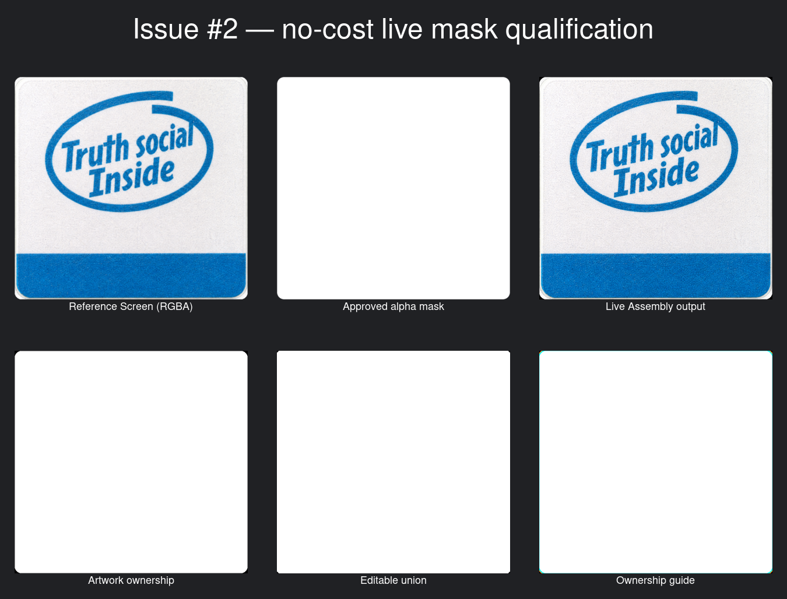
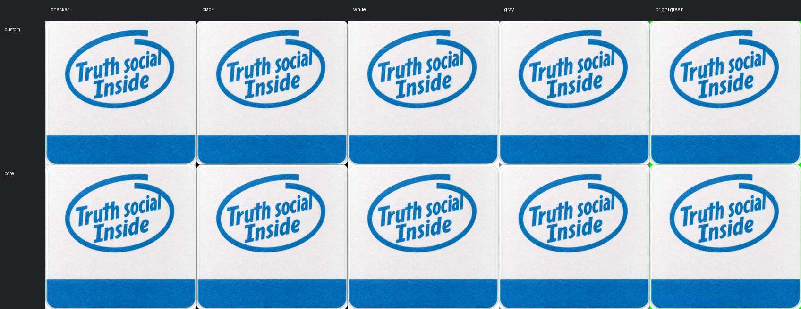
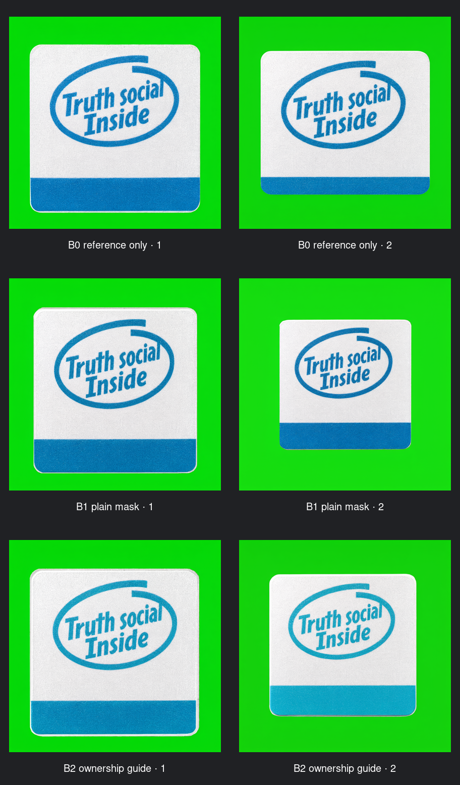

# Issue #2 verification report

## What changed

This change adds an optional mask-aware Assembly path. It lets ComfyUI replace
pixels only inside an approved shape and then stops the workflow if protected
pixels or approved artwork changed unexpectedly.

It does **not** replace Qwen Image 3 Pro, OpenRouter, Alibaba, the provider
router, or the existing rectangle workflow.

## What to review visually

The qualification sheet shows the frozen reference, independent mask, selected
mask bands, and the core-only comparison:

The actual custom and core candidate outputs are each combined with their own
candidate mask, then shown over checker, black, white, gray, and bright green
backgrounds so transparency and edge leakage are visible:

The generation sheet shows two outputs for each matched condition: reference
only, reference plus raw mask, and reference plus the labelled ownership guide:

The two mask-guided conditions did not improve the pair consistently. They
changed subject scale, and the labelled guide also shifted the cyan artwork
color. The workflow therefore uses the mask for deterministic Assembly, not as
a claimed Qwen inpainting control. Human visual acceptance is still pending.

## Objective result

- The selected custom path and the core-only alpha path produced identical
  decoded RGB pixels on the 988 x 944 frozen fixture.
- Both paths had zero false opaque and zero false transparent pixels against the
  independent ground-truth mask.
- Both paths recorded zero changed pixels outside the mask, silhouette IoU 1.0,
  zero centroid/scale drift, and zero boundary-band error.
- The selected path additionally names artwork, cutline, contact, editable, and
  immutable regions and fails closed on protected-pixel or artwork drift.
- The Assembly output is RGB on a destination canvas. Transparency is carried
  and tested as a separate mask; this report does not claim an RGBA SaveImage
  output.
- The ownership-band node intentionally thresholds soft mask input at the
  declared threshold. A runtime test locks that boundary behavior.
- Native BiRefNet was researched but not downloaded or run because its weight
  was absent and the deterministic candidates already passed the fixture.

Exact prompt IDs, workflow JSON, hashes, runtime versions, and comparison
metrics are in [the qualification manifest](qualification/run.json) and
[the generation manifest](generation/run.json).

## Paid comparison

- Provider: OpenRouter
- Model: `qwen/qwen-image-3-pro`
- Successful outputs: 6 of the effective 10-output cap
- Actual total: $0.255
- Pre-submission estimate: not captured; recorded as a limitation
- Ambiguous possibly billed outputs: 0

One earlier request completed zero outputs because OpenRouter rejected it with
HTTP 402 before generation. It was not retried automatically. The human added
credits before the successful submissions.

## Verification completed

- `python3.12 -m unittest discover -s tests -v` — 57 tests run successfully,
  including 9 expected Torch skips in the lightweight environment.
- `node --test tests/figma-mcp-client.test.mjs tests/figma-oauth-bootstrap.test.mjs`
  — 11 passed.
- ComfyUI virtual-environment node suite — 13 passed, including inverted mask
  polarity, soft alpha, batch expansion, shifted geometry, and deliberate
  protected-pixel/artwork failures.
- `python3.12 -m compileall -q qwen_ui_pipeline tests scripts` — passed.
- `bash -n deploy/install-sticker-tooling.sh` — passed.
- Every Issue #2 JSON file parsed successfully.
- `git diff --check` — passed.
- Explicit installer copy check — passed with byte-identical source and
  destination files; the installer did not restart ComfyUI.
- Fresh virtual environment: `pip install -e .`, `pip check`, and the full
  Python suite passed with the declared Pillow dependency.

The full research record and remaining limitations are in
[the qualification note](../../docs/research/comfyui-mask-node-qualification.md).
