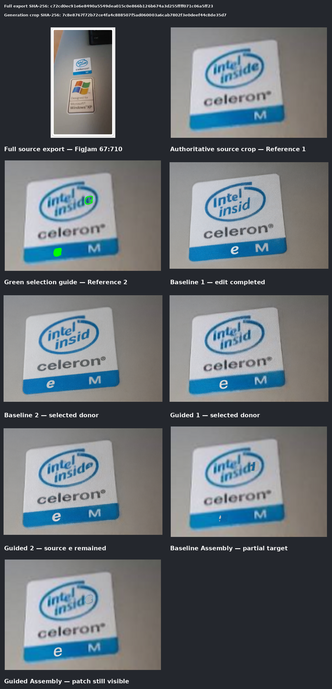

# Issue #2 verification report

## What changed

This change adds an optional mask-aware Assembly path. It lets ComfyUI replace
pixels only inside an approved shape and then stops the workflow if protected
pixels or approved artwork changed unexpectedly.

It does **not** replace Qwen Image 3 Pro, OpenRouter, Alibaba, the provider
router, or the existing rectangle workflow.

## What to review visually

The corrected comparison starts from the original Intel Inside/Celeron source
crop. It does **not** use the previously generated Truth Social sticker as a
Reference Screen, donor, or Qwen input.

The rows show the source and green guide, two source-only Qwen outputs, two
source-plus-guide Qwen outputs, and one bounded Assembly candidate from each
condition. The source-only baseline completed the requested edit in 2 of 2
outputs. The guided condition completed it in 1 of 2. The guide therefore did
not improve Qwen generation consistency.

The selected guided donor placed the relocated white `e` more completely during
deterministic Assembly. That candidate changed zero pixels outside the approved
6,913-pixel region, but its source-removal patch is still visible. It is useful
evidence, not an approved final. Human visual acceptance is pending.

## Objective result

- The selected custom path and the core-only alpha path produced identical
  decoded RGB pixels on the 988 x 944 frozen fixture.
- Both paths had zero false opaque and zero false transparent pixels against the
  independent ground-truth mask.
- Both paths recorded zero changed pixels outside the mask, silhouette IoU 1.0,
  zero centroid/scale drift, and zero boundary-band error.
- The selected path additionally names artwork, cutline, contact, editable, and
  immutable regions and fails closed on protected-pixel or artwork drift.
- The Assembly output is RGB on a destination canvas. Transparency is carried
  and tested as a separate mask; this report does not claim an RGBA SaveImage
  output.
- The ownership-band node intentionally thresholds soft mask input at the
  declared threshold. A runtime test locks that boundary behavior.
- Native BiRefNet was researched but not downloaded or run because its weight
  was absent and the deterministic candidates already passed the fixture.

Exact source hashes, prompt IDs, workflow JSON, output hashes, costs, node
experiments, and comparison findings are in
[the corrected run manifest](useful-edit/run.json). The earlier qualification
and six-output generation records remain as rejected historical evidence; they
are not evidence for the corrected source-based comparison. The repetitive
no-cost sheets are retained only in `rejected-historical/`, outside the current
human-review evidence.

## Corrected paid comparison

- Provider: OpenRouter
- Model: `qwen/qwen-image-3-pro`
- Source: original Intel Inside/Celeron crop, SHA-256
  `7c8e8767f72b72ce4fa4c888507f5ad060003a6cab7802f3e0deef44c8de35d7`
- Successful corrected outputs: 4
- Corrected-run actual total: $0.169
- Corrected-run pre-submission estimate: $0.17
- Cumulative recorded Issue cost: $0.424, including $0.255 for the rejected
  historical outputs
- Effective Issue output count: 10 of 10, including the six rejected historical
  outputs
- Ambiguous possibly billed outputs: 0

Both corrected conditions used the same prompt, settings, seed, and source
image. Only the guided condition received the green selection guide as
Reference 2. No further paid outputs are permitted for this Issue.

One earlier request completed zero outputs because OpenRouter rejected it with
HTTP 402 before generation. It was not retried automatically. The human added
credits before the successful submissions. The six later outputs from that old
test used a prior generated sticker as their reference, so they remain preserved
for provenance but are rejected as validation of the source-based workflow.

## Verification completed

- `python3.12 -m unittest discover -s tests -v` — 67 tests run successfully,
  including 9 expected Torch skips in the lightweight environment.
- `node --test tests/figma-mcp-client.test.mjs tests/figma-oauth-bootstrap.test.mjs`
  — 11 passed.
- ComfyUI virtual-environment node suite — 13 passed, including inverted mask
  polarity, soft alpha, batch expansion, shifted geometry, and deliberate
  protected-pixel/artwork failures.
- `python3.12 -m compileall -q qwen_ui_pipeline tests scripts` — passed.
- `bash -n deploy/install-sticker-tooling.sh` — passed.
- Every Issue #2 JSON file parsed successfully.
- `git diff --check` — passed.
- Explicit installer copy check — passed with byte-identical source and
  destination files; the installer did not restart ComfyUI.
- Fresh virtual environment: `pip install -e .`, `pip check`, and the full
  Python suite passed with the declared Pillow dependency.

The full research record and remaining limitations are in
[the qualification note](../../docs/research/comfyui-mask-node-qualification.md).
