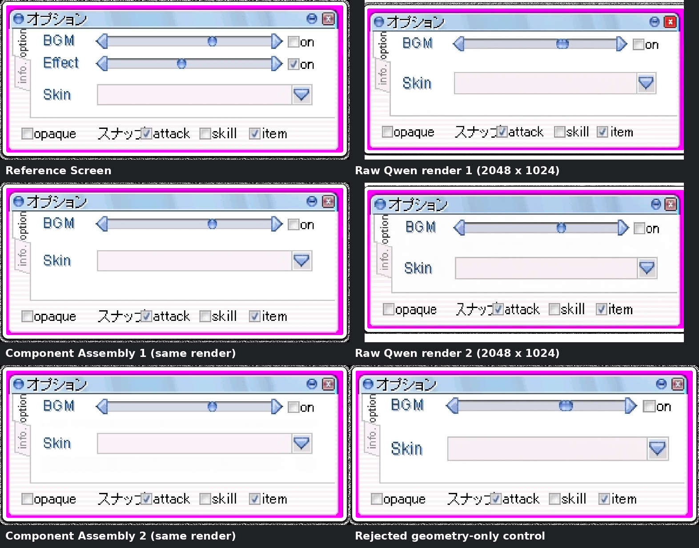

# Issue 34 component Assembly v004

Status: qualifying experiment; human visual approval remains required.

## Visible result

Both retained 2048 x 1024 direct Qwen renders already remove the Effect row,
but they redraw the screen and contain malformed small copy/control geometry.
The graph consumes those exact raw renders, normalizes each to 1572 x 718, and
makes an internal improvement that the earlier rectangle mask did not:

- crop a blank band from each saved Qwen donor and scale it into the two-row
  body as a generated clean plate;
- restore the source-owned BGM label, slider, arrows, and unchecked `on`
  state at their original position;
- restore the source-owned Skin label and dropdown 75 pixels higher, reflowing
  it into the space left by the removed Effect row; and
- use the region composite only at the end to preserve the exterior and alpha.

The node contribution is therefore the repaired interior copy, controls, and
row placement. Exterior containment is a separate delivery guardrail.

## Repeated objective checks

| Check | Donor 1 | Donor 2 |
| --- | ---: | ---: |
| Output | 1572 x 718 RGBA | 1572 x 718 RGBA |
| Changed RGBA pixels outside `160,130,1350,350` | 0 | 0 |
| Changed alpha pixels | 0 | 0 |
| BGM component pixels different from source | 0 | 0 |
| Reflowed Skin component pixels different from source | 0 | 0 |
| `オプション` guardrail | byte-identical | byte-identical |
| `スナップ` guardrail | byte-identical | byte-identical |
| Effect rows / BGM sliders / Skin dropdowns | 0 / 1 / 1 | 0 / 1 / 1 |
| Changed RGBA pixels inside edit region vs source | 238,344 | 267,433 |
| Node-changed RGBA pixels inside region vs normalized donor | 305,914 | 433,332 |
| Node-changed pixels in source-component union vs normalized donor | 244,049 | 304,278 |
| Node-changed exposed clean-plate pixels vs normalized donor | 49,828 | 92,447 |
| Node-changed source-owned margin pixels vs normalized donor | 12,037 | 36,607 |

The `0 / 1 / 1` count is output-derived: both declared source components are
byte-identical at their targets, and every exposed clean-plate pixel has
luminance at least 251 (zero pixels below the recorded foreground threshold of
240). A dark Effect label, track, arrow, handle, checkbox, or duplicate control
outside the two exact components would fail this check.

The outputs have distinct hashes because each retains its own Qwen clean-plate
pixels. This is repeatability of the method, not duplicate files.

## Graphs and controls

The winning native graph, including the previously omitted raw-donor lineage,
is:

`LoadImage(source + raw donor) -> ImageScale(raw donor to 1572 x 718, nearest-exact) -> ImageCropV2(donor clean plate) -> ImageScale(nearest-exact) -> ImageCompositeMasked(clean plate) -> ImageCropV2 + ImageCompositeMasked(source BGM) -> ImageCropV2 + ImageCompositeMasked(source Skin at y=280) -> ReferenceRegionComposite(exterior/alpha guardrail) -> SaveImage`

The corrected raw-input graph ran twice against the live ComfyUI 0.31.0 catalog
in 201 ms and 195 ms. A separate matched-donor normalization control ran in
206 ms. The raw renders, normalized intermediates, outputs, and exact API JSON
are all retained and hash-linked in `run.json`.

The four outputs from the aspect-normalization control are retained under
`controls/`. Center-cropping changed donor proportions but retained malformed
copy and layout, so it is neutral rather than credited as an improvement.
Green guidance, alpha-only postprocessing, hard rectangle containment alone,
feathering, and generic JoinImageWithAlpha were already rejected in earlier
Issue 34 phases.

## Paid provenance and stopping

No new paid Render Pass was submitted. Issue 34 has 8 requested outputs
accounted for: 6 completed outputs at $0.249 confirmed actual cost and one
2-output focused-crop request with ambiguous billing counted as spent. The
component arm qualified on both saved donors, so the final two-output allowance
was not used.

See `run.json` for paid and no-cost prompt IDs, seeds, estimated/actual costs,
native raw-render hashes, normalization lineage, dimensions, exact checks,
execution durations, and the stopping reason. See
`docs/research/issue-34-internal-repair-methods.md` for the primary-source
research and ranked matrix.

## Limits

- This is deterministic Assembly, not mask-guided Qwen generation.
- Exact source components must be explicitly declared; the workflow does not
  discover semantic components automatically.
- The clean plate is intentionally a low-detail donor band. A textured or
  spatially varying background may require a different accepted donor crop.
- Human review must still judge spacing, background continuity, and whether
  the result is suitable to merge.

Regenerate the manifest and contact sheet from the pinned artifacts with
`python3.12 -m pip install -e '.[evidence]'` followed by
`python3.12 scripts/build_issue34_component_evidence.py`.
